I'm a full stack engineer at **[Cannabud.ai](https://cannabud.ai)**, where I build production web and mobile products end to end: React and React Native on the front, Python, Go and Node behind them, Postgres underneath.

That work isn't on GitHub, so this is where my side projects live. I pick ones where you can't fake the answer: a click either did something or it didn't, and a forecast either matched the waves or it didn't.

## Featured projects

<table>
  <tr>
    <td width="50%" valign="top">
      <h3><a href="https://github.com/B1CA16/frustration-observer">frustration-observer</a></h3>
      Detects rage clicks, hesitation and dead clicks on any DOM element. 2.5 KB, zero dependencies, framework agnostic.
        
      <code>TypeScript</code> <code>npm</code> <code>CI</code>
        
      <a href="https://b1ca16.github.io/frustration-observer/"><b>Live demo →</b></a> &nbsp;·&nbsp; <a href="https://www.npmjs.com/package/frustration-observer">npm</a>
    </td>
    <td width="50%" valign="top">
      <h3><a href="https://github.com/B1CA16/before">BeFORE</a></h3>
      Surf forecasting for the Lisbon coast. A transparent score you can audit, plus a wind-correction model trained on data I collect myself. No LLMs.
        
      <code>Python</code> <code>FastAPI</code> <code>Next.js</code> <code>PostGIS</code> <code>ML</code>
        
      <a href="https://before-steel.vercel.app"><b>Live →</b></a>
    </td>
  </tr>
  <tr>
    <td width="50%" valign="top">
      <h3><a href="https://github.com/B1CA16/kristin">kristin</a></h3>
      Movie and TV recommendations picked by people instead of a black box. Community suggestions, voting, reviews, in 4 languages.
        
      <code>Next.js</code> <code>Supabase</code> <code>Postgres</code> <code>i18n</code>
        
      <a href="https://trykristin.vercel.app"><b>Live →</b></a>
    </td>
    <td width="50%" valign="top">
      <h3><a href="https://github.com/B1CA16/taskforge">taskforge</a></h3>
      A background job queue built from scratch on Postgres: retries with backoff, a dead-letter queue, and concurrent workers via <code>SKIP LOCKED</code>.
        
      <code>Python</code> <code>SQLAlchemy</code> <code>Postgres</code>
        
      <a href="https://github.com/B1CA16/taskforge"><b>Source →</b></a>
    </td>
  </tr>
</table>

## Stack

<table>
  <tr>
    <td><b>Languages</b></td>
    <td></td>
  </tr>
  <tr>
    <td><b>Frontend &amp; mobile</b></td>
    <td> &nbsp;+ React Native</td>
  </tr>
  <tr>
    <td><b>Backend</b></td>
    <td> &nbsp;+ REST APIs</td>
  </tr>
  <tr>
    <td><b>Data &amp; infra</b></td>
    <td></td>
  </tr>
</table>

  
  

